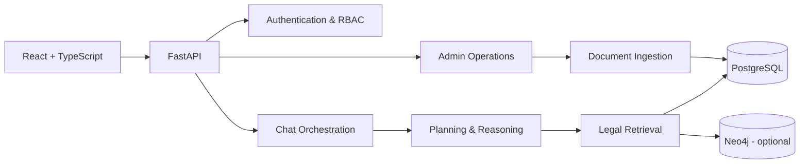

# LawChat-AI

LawChat-AI is a personal LegalTech project that I am actively developing to explore how AI can support users working with the Vietnamese legal system.

The project focuses on three core goals:

- enabling users to ask legal questions in natural language;
- retrieving, analyzing, and answering questions with supporting legal authorities;
- providing tools for legal data administration, quality evaluation, and escalation to legal professionals when expert advice is needed.

> This is the public portfolio edition of the project. Legal datasets, internal documents, user uploads, database backups, API keys, and operational data are intentionally excluded from this repository.

## Product Screenshots

### AI Legal Assistant

A natural-language question-and-answer experience for Vietnamese law, with bilingual support and a conversational interface available directly from the home page.


### Legal Document Ingestion and Standardization

An administrative workflow for extracting content, editing documents, standardizing metadata, and preparing legal materials for ingestion.


### Legal Knowledge Annotation

A review workspace for validating provision structure, legal entities, metadata, and retrieval ground truth.


## What I Built

### User Experience

- A bilingual Vietnamese/English LegalTech landing page.
- A responsive conversational interface for the AI legal assistant.
- Answer views that support legal authority references and safety notices.
- Registration, authentication, and role-based access flows.
- A workflow for escalating consultation requests to lawyers or legal specialists.

### Administration System

- An administrative dashboard for legal documents, catalogs, and users.
- Document upload, extraction, editing, and ingestion workflows.
- Management of metadata, legal provisions, and relationships between documents.
- Review queues, activity auditing, and corpus quality reporting.
- Configuration for AI providers, embeddings, and graph backends.

### AI and Legal Retrieval

- A retrieval pipeline designed for legal data.
- Structure-aware chunking for legal documents.
- Question planning, reasoning, and validation components.
- A citation-aware answer workflow.
- Confidence assessment and expert-escalation recommendations.
- Knowledge graph experiments using relational data and Neo4j.

## High-Level Architecture



## Technology Stack

**Frontend**

- React 19, TypeScript, and Vite
- React Router, Zustand, and Axios
- TipTap rich-text editor
- Responsive CSS design system

**Backend**

- Python, FastAPI, and Pydantic
- SQLAlchemy, Alembic, and PostgreSQL
- JWT authentication and role-based access control
- OCR and document extraction with Tesseract, PDFium, and python-docx
- Sentence Transformers and OpenAI-compatible providers
- Neo4j integration

**Engineering**

- Service- and repository-oriented backend architecture
- Versioned database migrations
- Automated backend tests
- Frontend linting and production build verification
- A privacy-aware public repository workflow

## Source Code Structure

```text
LAWCHAT-AI-Public/
  backend/
    migrations/          Database migrations
    scripts/             Operational and import utilities
    src/
      agents/            AI-oriented agents
      api/               FastAPI routers
      core/              Configuration, security, and bootstrap
      ingestion/         Extraction and ingestion pipelines
      models/            SQLAlchemy models
      orchestration/     Case planning and execution flow
      reasoning/         Legal reasoning components
      repositories/      Data access layer
      retrieval/         Legal retrieval and ranking
      services/          Application services
      tools/             Deterministic legal tools
      validation/        Answer and workflow validation
    tests/               Backend test suite
  frontend/
    src/
      components/        Shared application components
      features/          Feature-oriented modules
      hooks/             Application operation hooks
      locales/           Vietnamese and English content
      pages/             Product pages
      store/             Client state management
      styles/            Design system and responsive themes
```

## Getting Started

### Prerequisites

- Python 3.11+
- Node.js 20+
- PostgreSQL
- Tesseract OCR, if you want to test OCR workflows

### Backend

From the repository root, run:

```powershell
Copy-Item .env.example .env
.\scripts\start-backend.ps1
```

The script creates or reuses a project-specific `.venv`, installs missing dependencies, and starts the API at `http://127.0.0.1:8000`.

### Frontend

```powershell
cd frontend
npm install
Copy-Item .env.example .env
npm run dev
```

The frontend runs at `http://localhost:5173` by default.

## Quality Checks

```powershell
# Backend tests
cd backend
$env:PYTHONPATH='.'
pytest

# Frontend
cd frontend
npm run lint
npm run build
```

## Development Status

LawChat-AI is under active development. Current areas of improvement include:

- improving retrieval quality and legal citations;
- standardizing Vietnamese legal data;
- evaluating reasoning through controlled benchmarks;
- strengthening expert-review workflows;
- improving mobile usability and accessibility.

## Public Data Policy

The public repository does not include:

- the legal corpus or source documents used during development;
- requirement documents, internal plans, or project reports;
- user uploads, OCR models, or annotation data;
- benchmark cases or reports generated from internal data;
- database dumps, runtime storage, or logs;
- `.env` files, API keys, or other credentials.

## Disclaimer

LawChat-AI is an experimental product and is not a substitute for advice from a qualified legal professional. Any content generated by the system should be independently reviewed before it is used in a real-world legal matter.
