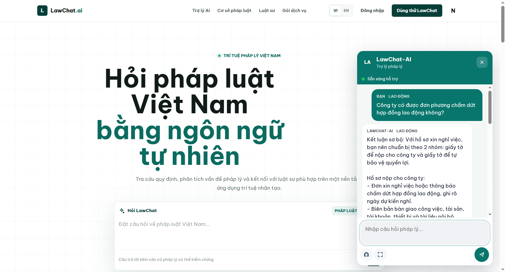
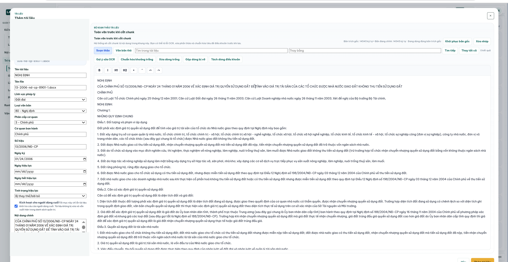
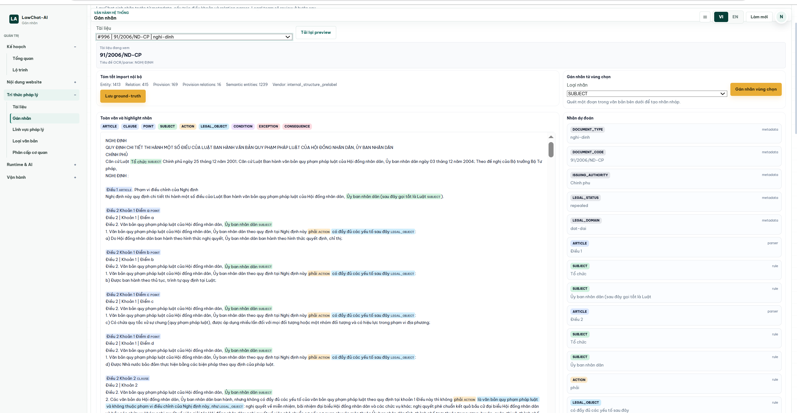
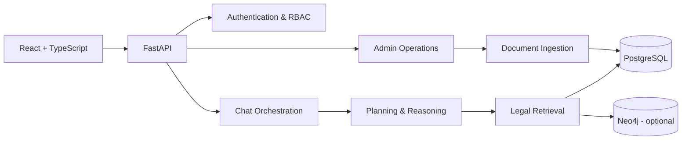

# LawChat-AI

LawChat-AI là dự án cá nhân tôi đang phát triển nhằm xây dựng một nền tảng LegalTech ứng dụng AI cho hệ thống pháp luật Việt Nam.

Dự án tập trung vào ba bài toán chính:

- giúp người dùng đặt câu hỏi pháp lý bằng ngôn ngữ tự nhiên;
- hỗ trợ tra cứu, phân tích và trả lời dựa trên căn cứ pháp luật;
- cung cấp công cụ quản trị dữ liệu pháp luật, đánh giá chất lượng và kết nối luật sư khi cần tư vấn chuyên sâu.

> Đây là phiên bản source code công khai phục vụ portfolio. Dữ liệu pháp luật, tài liệu nội bộ, file người dùng tải lên, database backup, API key và dữ liệu vận hành không được đưa vào repository này.

## Hình Ảnh Sản Phẩm

### Trợ lý pháp lý AI

Giao diện hỏi đáp pháp luật Việt Nam bằng ngôn ngữ tự nhiên, hỗ trợ trải nghiệm song ngữ và hội thoại ngay trên trang chủ.



### Nhập và chuẩn hóa văn bản pháp luật

Quy trình quản trị tài liệu gồm trích xuất nội dung, chỉnh sửa văn bản, chuẩn hóa metadata và chuẩn bị dữ liệu trước khi ingest.



### Gán nhãn tri thức pháp lý

Workspace phục vụ review cấu trúc điều khoản, thực thể pháp lý, metadata và ground-truth cho quá trình đánh giá retrieval.



## Tôi Đã Xây Dựng Những Gì

### Trải nghiệm người dùng

- Landing page LegalTech song ngữ Việt/Anh.
- Trợ lý pháp lý AI với giao diện hội thoại responsive.
- Câu trả lời hỗ trợ hiển thị cảnh báo và căn cứ pháp lý.
- Luồng đăng ký, đăng nhập và phân quyền theo vai trò.
- Kết nối yêu cầu tư vấn đến luật sư/chuyên viên.

### Hệ thống quản trị

- Dashboard quản trị văn bản pháp luật, danh mục và người dùng.
- Quy trình tải lên, trích xuất, chỉnh sửa và ingest tài liệu.
- Quản lý metadata, điều khoản pháp luật và quan hệ giữa văn bản.
- Review queue, audit activity và báo cáo chất lượng corpus.
- Cấu hình AI provider, embedding và graph backend.

### AI và Legal Retrieval

- Retrieval pipeline dành cho dữ liệu pháp luật.
- Chunking tài liệu theo cấu trúc pháp lý.
- Lập kế hoạch xử lý câu hỏi, reasoning và validation.
- Citation-aware answer flow.
- Cơ chế đánh giá độ tin cậy và đề xuất chuyển chuyên gia.
- Thử nghiệm knowledge graph với relational database và Neo4j.

## Kiến Trúc Tổng Quan



## Công Nghệ Sử Dụng

**Frontend**

- React 19, TypeScript, Vite
- React Router, Zustand, Axios
- TipTap rich-text editor
- Responsive CSS design system

**Backend**

- Python, FastAPI, Pydantic
- SQLAlchemy, Alembic, PostgreSQL
- JWT authentication và role-based access control
- OCR/document extraction với Tesseract, PDFium và python-docx
- Sentence Transformers, OpenAI-compatible providers
- Neo4j integration

**Engineering**

- Service/repository-oriented backend architecture
- Database migrations
- Automated backend tests
- Frontend lint và production build verification
- Privacy-aware public repository workflow

## Cấu Trúc Source Code

```text
LAWCHAT-AI-Public/
  backend/
    migrations/          Database migrations
    scripts/             Operational and import utilities
    src/
      agents/            AI-oriented agents
      api/               FastAPI routers
      core/              Configuration, security and bootstrap
      ingestion/         Extraction and ingestion pipelines
      models/            SQLAlchemy models
      orchestration/     Case planning and execution flow
      reasoning/         Legal reasoning components
      repositories/      Data access layer
      retrieval/         Legal retrieval and ranking
      services/          Application services
      tools/             Deterministic legal tools
      validation/        Answer and workflow validation
    tests/               Backend test suite
  frontend/
    src/
      components/        Shared application components
      features/          Feature-oriented modules
      hooks/             Application operation hooks
      locales/           Vietnamese and English content
      pages/             Product pages
      store/             Client state management
      styles/            Design system and responsive themes
```

## Chạy Dự Án

### Yêu cầu

- Python 3.11+
- Node.js 20+
- PostgreSQL
- Tesseract OCR nếu cần thử nghiệm OCR

### Backend

```powershell
Copy-Item .env.example .env
.\scripts\start-backend.ps1
```

Script sẽ tạo hoặc sử dụng `.venv` riêng của dự án, cài dependency còn thiếu và khởi động API tại `http://127.0.0.1:8000`.

### Frontend

```powershell
cd frontend
npm install
Copy-Item .env.example .env
npm run dev
```

Frontend mặc định chạy tại `http://localhost:5173`.

## Kiểm Tra Chất Lượng

```powershell
# Backend tests
cd backend
$env:PYTHONPATH='.'
pytest

# Frontend
cd frontend
npm run lint
npm run build
```

## Trạng Thái Phát Triển

Dự án đang được tiếp tục phát triển. Các hướng cải tiến hiện tại:

- nâng cao chất lượng retrieval và citation;
- chuẩn hóa dữ liệu pháp luật Việt Nam;
- đánh giá reasoning bằng benchmark có kiểm soát;
- hoàn thiện quy trình review bởi chuyên gia;
- tối ưu trải nghiệm mobile và khả năng tiếp cận.

## Chính Sách Dữ Liệu Public

Repository public không bao gồm:

- corpus và tài liệu pháp luật dùng trong quá trình phát triển;
- tài liệu yêu cầu, kế hoạch nội bộ và báo cáo dự án;
- file tải lên, OCR model và dữ liệu annotation;
- benchmark cases và báo cáo được sinh từ dữ liệu nội bộ;
- database dump, runtime storage và log;
- `.env`, API key hoặc thông tin xác thực.

## English Summary

LawChat-AI is an actively developed personal LegalTech project focused on Vietnamese law. It demonstrates full-stack product development, legal document ingestion, retrieval-oriented AI architecture, citation-aware answers, role-based workflows, and an operational admin dashboard.

This public portfolio repository contains source code only. Private legal documents, datasets, internal documentation, credentials, runtime storage, and generated evaluation data are intentionally excluded.

## Disclaimer

LawChat-AI là sản phẩm thử nghiệm và không thay thế ý kiến tư vấn của luật sư. Nội dung do hệ thống tạo ra cần được kiểm tra trước khi sử dụng trong tình huống thực tế.
